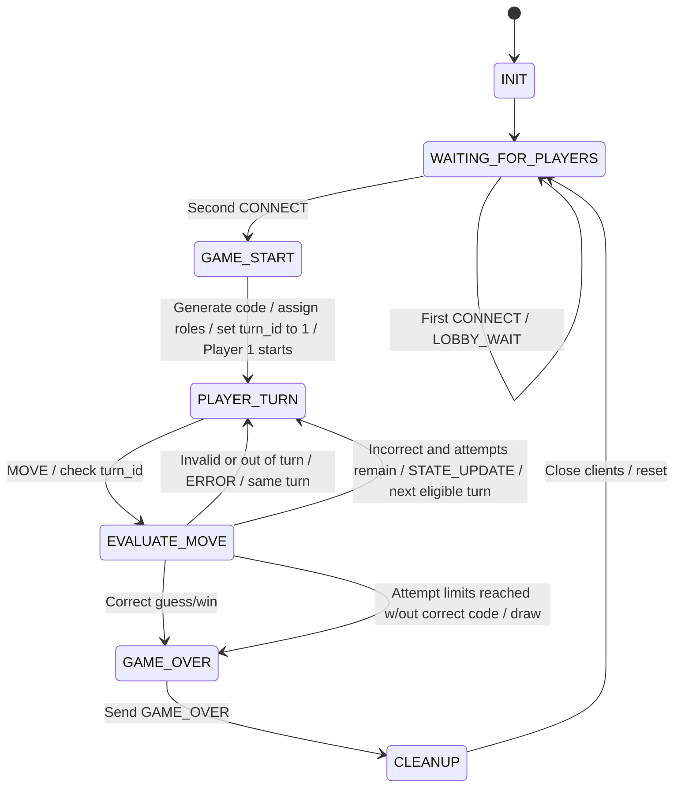
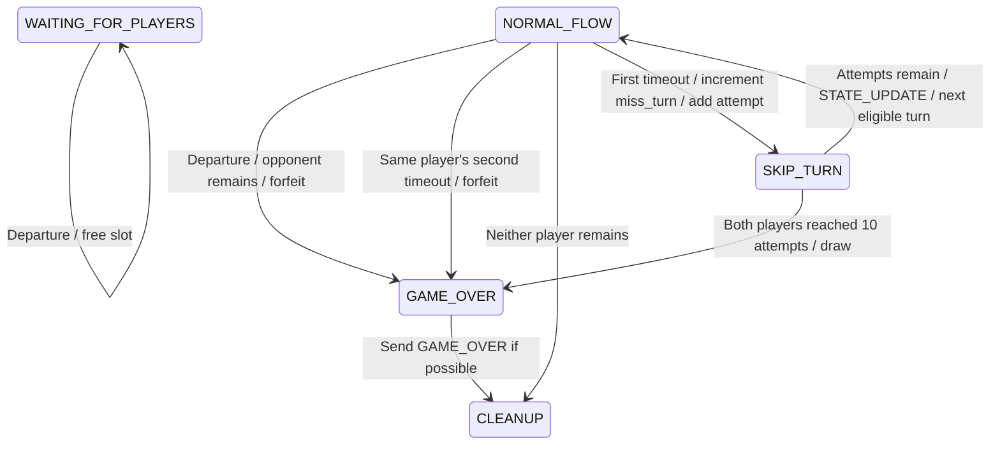

Detailed state transition diagram created strictly using Mermaid (stateDiagram-v2) syntax and state handling logic, explicitly addressing valid moves, invalid moves, and unexpected client disconnections.

Broken into two diagrams as it was overlapping

***Normal Flow***

***Dissconnections***

***NORMAL_FLOW represents GAME_START, PLAYER_TURN, and EVALUATE_MOVE in the first diagram. Timeout paths apply only during PLAYER_TURN. Departure means DISCONNECT, TCP EOF, or a socket error.***

**INIT:** Initialize server, listening socket, and new game data.

**WAITING_FOR_PLAYERS:** Accepts valid CONNECT requests. First accepted connection will be player 1 and will receive LOBBY_WAIT. Once a second CONNECT request is accepted, the game will transition to GAME_START. If the waiting player disconnects, free their player slot.

**GAME_START:** Generates a 4 digit secret code with no repeated numbers, sets both players’ attempt counts and miss_turn variables to 0, and sends GAME_START to both clients. Player 1 starts.

**PLAYER_TURN**: Wait for a move while watching both connections for timeouts/disconnection. The server continues checking the turn deadline even while receiving an incomplete message.

**EVALUATE_MOVE:** Check that the msg comes from the active player and contains a valid 4 digit guess with no repeated numbers. An invalid or out of turn input will produce an ERROR response, does not add an attempt, does not reset the turn deadline, and keeps the same player turn active. A valid guess will increment that player’s attempt_count by 1 and return feedback of correct digits in the wrong positions and correct digits in the correct placement based on their input. A fully correct guess will end the game with that player listed as the winner. Else, if both players have reached 10 attempts, it will return a DRAW with no winner and display “You both lose.” If the game continues, the active player is switched to the next player with attempts remaining and STATE_UPDATE will be sent to both clients. If only one player has attempts remaining, that player continues.

Check that turn_id matches the current turn. A mismatch produces ERROR without changing the turn or attempt count. Each new turn, including one following a timeout, increments turn_id.

**GAME_OVER:** Record the result of winner, draw, or forfeit and send GAME_OVER with the results and final guess, if any, to connected clients. If neither player remains connected before a result is recorded, proceed to CLEANUP without a winner. Once recorded, the result will not change due to later disconnections.

**CLEANUP:** Close client sockets and clear players, secret code, attempts, miss_turn counters, turn timers, and any other history from the session. Keep the listening socket open for a new game by returning to WAITING_FOR_PLAYERS.

**TIMEOUT:** Each player has 120 seconds to submit a complete, valid MOVE once their turn starts. The timer starts when the server sends GAME_START or STATE_UPDATE identifying that player as active. The valid MOVE must be completely received before the deadline. Invalid or out of turn messages do not reset the timer. On that player’s first timeout, increment their miss_turn counter by 1, skip their turn without reusing previous input, and add an attempt. If both players have now reached 10 attempts, transition to GAME_OVER with a DRAW and display “You both lose.” Otherwise, send STATE_UPDATE identifying the next player with attempts remaining and start a fresh 120-second timer for that turn. If only one player has attempts remaining, that player continues. On that same player’s second timeout during the game, the server transitions to GAME_OVER and the opponent wins by forfeit. Intentional DISCONNECT, TCP EOF, and socket errors are handled immediately.

**DISCONNECT:** A player can intentionally leave by sending a DISCONNECT message. Unexpected disconnections can be detected through socket errors or TCP EOF (`b""`). During an active game, these conditions will be considered a forfeit, leading to GAME_OVER with the connected opponent as the winner. If neither player remains connected before a result is recorded, proceed to CLEANUP without a winner. During WAITING_FOR_PLAYERS, the disconnected player’s slot will be freed.

The operating system handles the TCP FIN handshake. When `recv()` returns `b""`, the server stops reading from that socket and handles the player’s departure. If EOF occurs during an incomplete message header or payload, that incomplete message is discarded. Socket exceptions, including ConnectionResetError, BrokenPipeError, and ConnectionAbortedError, trigger the same departure handling. Each player’s disconnection is handled only once.