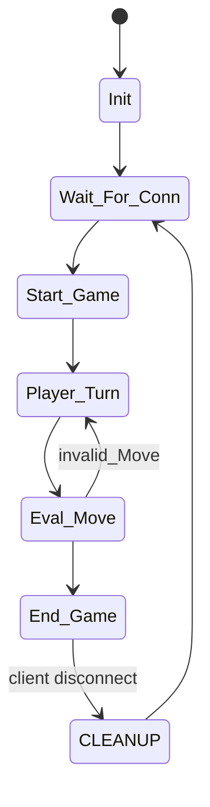

Detailed state transition diagram created strictly using Mermaid (stateDiagram-v2) syntax and state handling logic, explicitly addressing valid moves, invalid moves, and unexpected client disconnections.

