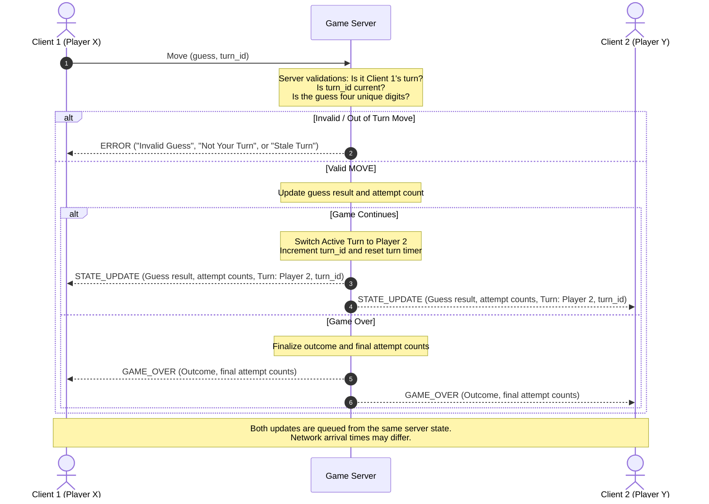

Basic Diagram o0f the sequence order

```mermaid
sequenceDiagram
    autonumber
    actor Client1 as Client 1 (Player X)
    participant Server as Game Server
    actor Client2 as Client 2 (Player Y)

    Client1->>Server: Move (guess, turn_id)
    Note over Server: Server validations: Is it Client 1's turn?<br>Is turn_id current?<br>Is the guess four unique digits?
    alt Invalid / Out of Turn Move
        Server-->>Client1: ERROR ("Invalid Guess", "Not Your Turn", or "Stale Turn")
    else Valid MOVE
        Note over Server: Update guess result and attempt count
        alt Game Continues
            Note over Server: Switch Active Turn to Player 2<br>Increment turn_id and reset turn timer
            Server-->>Client1: STATE_UPDATE (Guess result, attempt counts, Turn: Player 2, turn_id)
            Server-->>Client2: STATE_UPDATE (Guess result, attempt counts, Turn: Player 2, turn_id)
        else Game Over
            Note over Server: Finalize outcome and final attempt counts
            Server-->>Client1: GAME_OVER (Outcome, final attempt counts)
            Server-->>Client2: GAME_OVER (Outcome, final attempt counts)
        end
    end
    Note over Client1,Client2: Both updates are queued from the same server state.<br>Network arrival times may differ.
```
